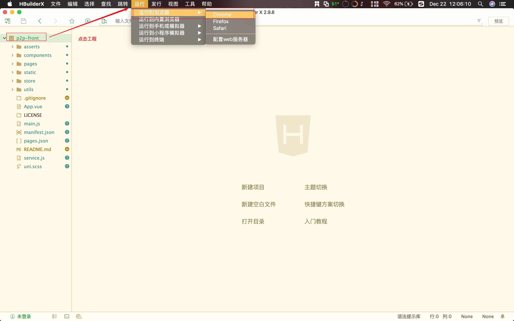
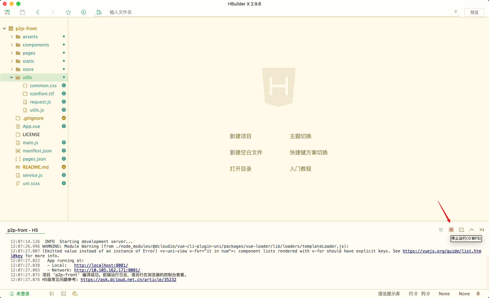

# wanxin-p2p-web


## 项目地址

| Github地址                                         | 说明            |
| -------------------------------------------------- | --------------- |
| https://github.com/mikuhuyo/wanxin-p2p-web.git     | 前端工程        |
| https://github.com/mikuhuyo/wanxin-p2p.git         | 后端工程        |
| https://github.com/mikuhuyo/wanxin-p2p-manager.git | 后台前端工程    |
| https://github.com/mikuhuyo/tencent-sms.git        | Tencent短信服务 |
| https://github.com/mikuhuyo/minio.git              | 存储服务        |

## 项目预览


## 目录结构

```shell

┌─components            # uni-app公共组件目录
│  └─comp-a.vue         # 可复用的a组件
├─pages                 # 业务页面文件存放的目录 详细内页查看pages.json 
├─static                # 存放本应用的图片静态资源
├─utils                 # 公共资源存放
│  └─common.css         # 公用样式文件
│  └─request.js         # 统一请求打包文件
│  └─utils.js           # 公用函数打包文件
├─main.js               # Vue初始化入口文件
├─App.vue               # 应用配置，用来配置App全局样式以及监听 应用生命周期
├─manifest.json         # 配置应用名称、appid、logo、版本等打包信息，详见
└─pages.json            # 配置页面路由、导航条、选项卡等页面类信息，详见

```

## 项目启动

### 安装插件(HBuilderX)

| 插件名称      | 说明                      |
| ------------- | ------------------------- |
| App真机运行   | App开发真机运行           |
| Git插件       | Git版本控制               |
| less编译      | 专业前端                  |
| scss/sass编译 | 专业前端                  |
| uni-app编译   | uni-app编译到各端的编译器 |
| 内置终端      | 终端                      |

### 启动方式





